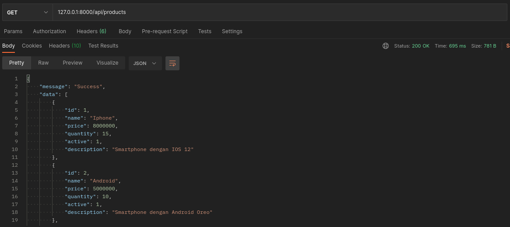
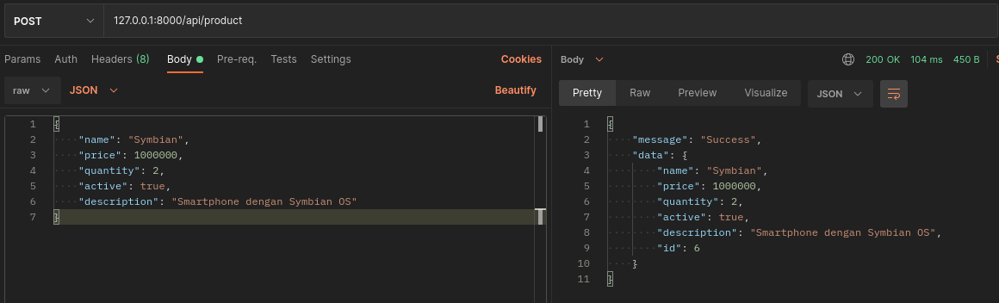
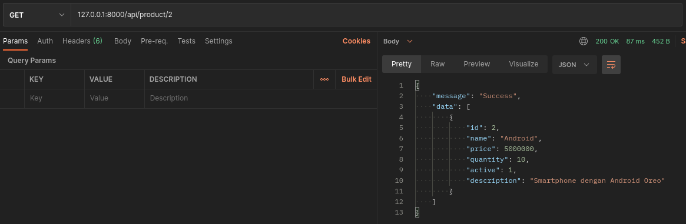
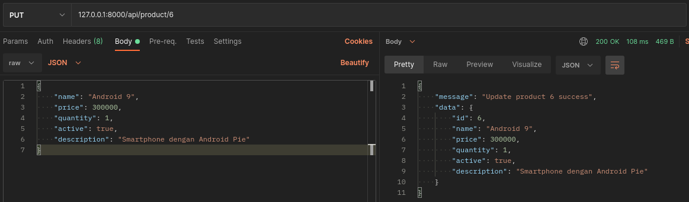
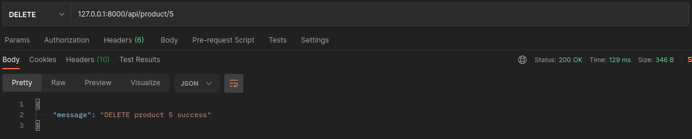
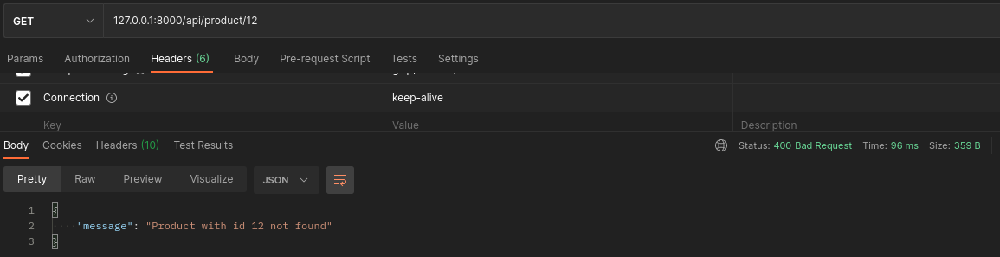

# api.product

## Table of Contents

- [api.product](#apiproduct)
  - [Table of Contents](#table-of-contents)
  - [About](#about)
  - [Screenshoot](#screenshoot)

## About
Simple RESTAPI product. build with Laravel 8 and MariaDB.

## Screenshoot

1. Get data products

2. Insert / post data product

3. Get data by id product

4. Update data product

5. Delete data product

6. Error Message

